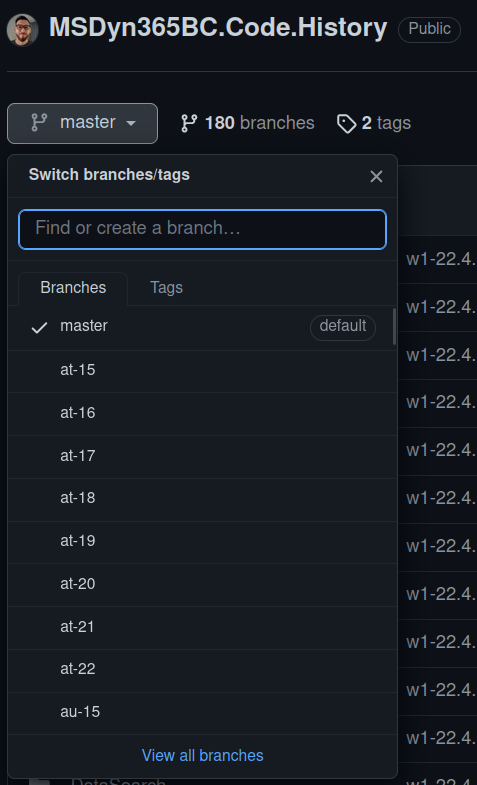
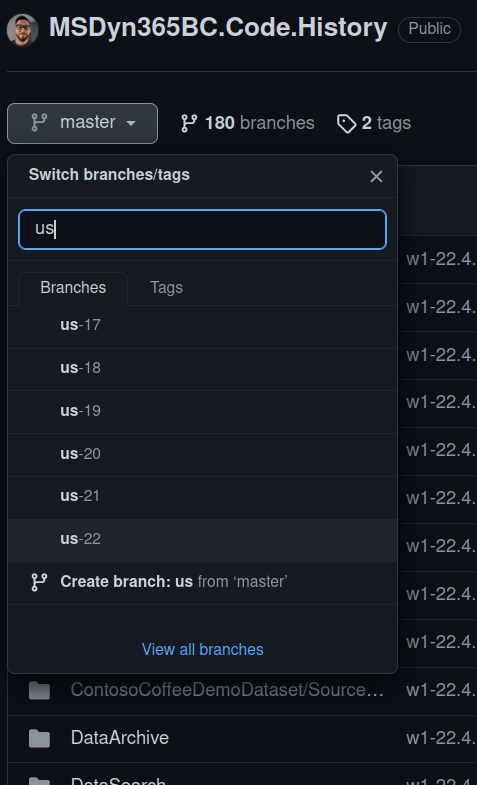
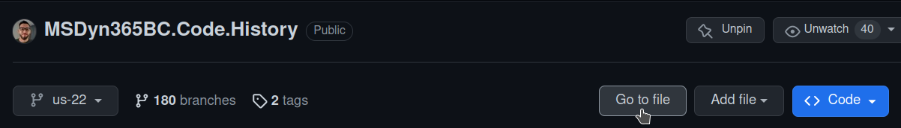
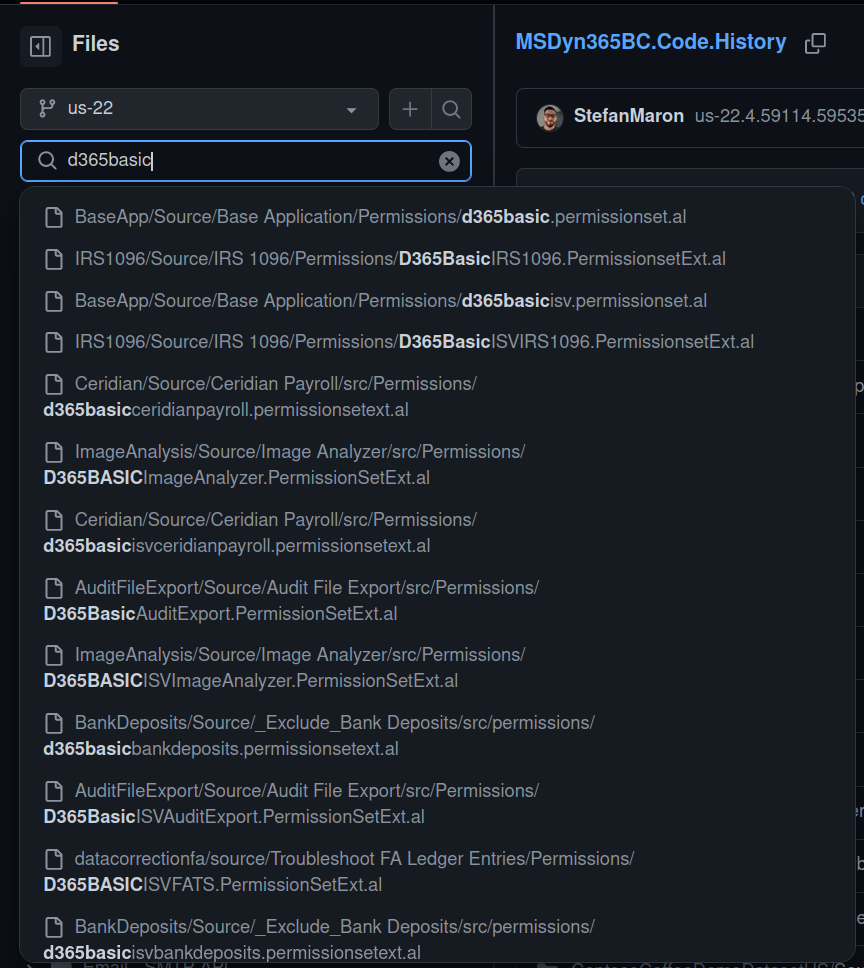
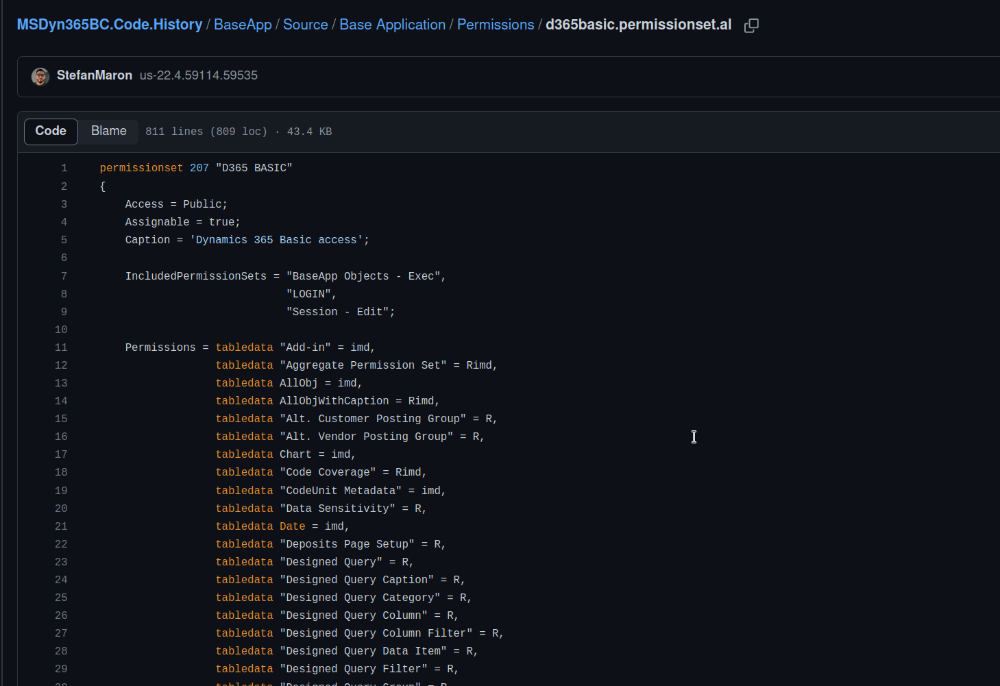
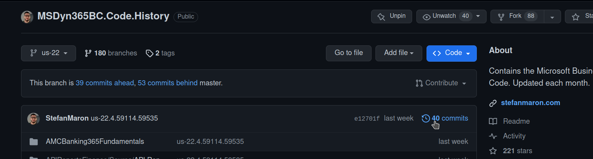
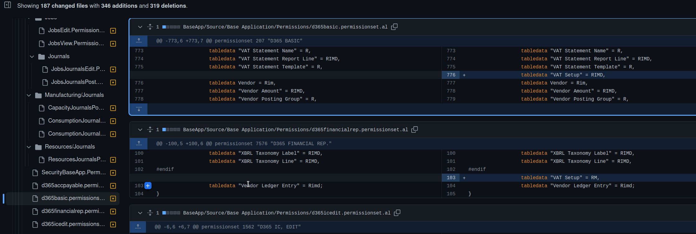

# How to check if one of the permissions sets from Microsoft change with an update

So I got asked on LinedIn how you can keep track of changes in Microsoft's code base for Business central. This is especially necessary when using the permission sets from Microsoft.

One of my tools you can use for this is the [MSDyn365BC.Code.History](https://github.com/StefanMaron/MSDyn365BC.Code.History) repository on GitHub. But since this more a resource for Developers, and checking permission sets might not always be a task a developer gets assigned, I want to make sure to explain in detail, how everyone can review the changes Microsoft does to their permission sets.

But first, maybe a little bit of background to this repository. I already mentioned, this is mainly a resource for developer. It contains all of the code that Microsoft makes available to us and is usually installed in a fresh Business Central environment. With every release Microsoft does (Major and Minor) I upload the changed code into the repository. And I do this for each country specific version as well. 

The different country versions, along with the Major versions, are tracked in "Branches". When you just click on the link above, you will land on the "master" branch. The master branch is the main branch of the repository and I always keep it in sync with the very latest version of the w1 localization. 

You can view, switch and search for different branches by clicking on the master branch selection:

That means the first step to do is, to select the right branch. If you are located in the us, just search for us and select the latest version:

Now you can use the "Search for File" functionality to find the object for the permission set you want to check for changes.

And now search for the code of the permission set.

If you are in the right place, you should see something like this:

And if you now click on "Blame" at the top you can see with which version each line was changed the last time.

If you need to know what changed exactly, you need to open the commits list, after you selected to correct branch:

And then select the version you want to view the changes for.
On the left side, you then can search again, for the permission set you want to check.
You also can just search for `.permissionset.al` to find all permission sets that where changed.
I scrolled down again to d365basic, and we can see that with the version I selected, just one row was added.

Thats it, you can apply this approach to any object you want to control changes for.

I hope that helps :)